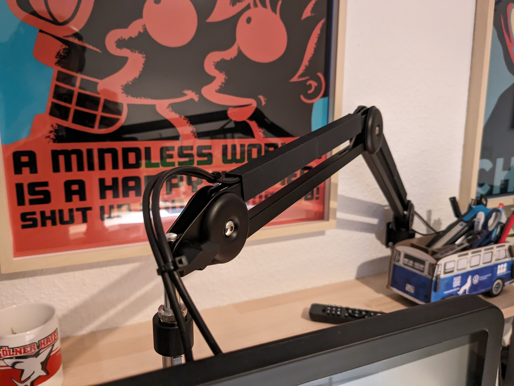
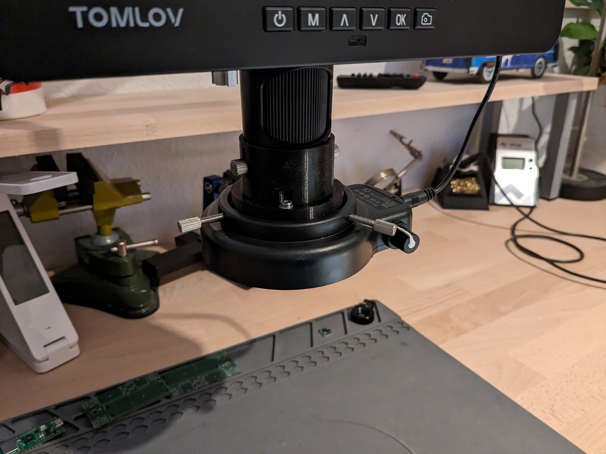

# Constructions

<table>
  <tr>
    <th>Construction</th>
    <th style="width:50%">>Preview</th>
  </tr>
  <tr>
    <td>
        <b>Name:</b> <a href="bicycle_shed/README.md">bicycle_shed</a> 
        <b>Description:</b> TODO. 
        <b>Tags:</b>
        <ul>
        </ul>
    </td>
    <td>
    
    </td>
  </tr>
  <tr>
    <td>
        <b>Name:</b> <a href="blister_hanger/README.md">blister_hanger</a> 
        <b>Description:</b> TODO. 
        <b>Tags:</b>
        <ul>
        </ul>
    </td>
    <td>
    
    </td>
  </tr>
  <tr>
    <td>
        <b>Name:</b> <a href="bosch_battery_holder_ikea_skadis/README.md">Bosch Battery Holder for IKEA Skadis</a> 
        <b>Description:</b> Battery holder magazine vor Bosch 12v batteries. 
        <b>Tags:</b>
        <ul>
            <li></li>
            <li></li>
            <li></li>
            <li></li>
            <li></li>
        </ul>
    </td>
    <td>
    
    </td>
  </tr>
  <tr>
    <td>
        <b>Name:</b> <a href="coffee_machine_skates/README.md">Coffee machine skates</a> 
        <b>Description:</b> None 
        <b>Tags:</b>
        <ul>
            <li></li>
        </ul>
    </td>
    <td>
    
    </td>
  </tr>
  <tr>
    <td>
        <b>Name:</b> <a href="coin_battery_storage/README.md">Drawer style coin battery storage</a> 
        <b>Description:</b> A drawer style storage for coin batteries of different types. The case comes with two heights to support different coin heights. 
        <b>Tags:</b>
        <ul>
            <li></li>
            <li></li>
        </ul>
    </td>
    <td>
    
    </td>
  </tr>
  <tr>
    <td>
        <b>Name:</b> <a href="filament_spoolholder/README.md">Simple Filament Spool holder</a> 
        <b>Description:</b> Yet another spool holder for 3D-Print filament. 
        <b>Tags:</b>
        <ul>
            <li></li>
            <li></li>
        </ul>
    </td>
    <td>
    
    </td>
  </tr>
  <tr>
    <td>
        <b>Name:</b> <a href="first_aid_kit_holder/README.md">First aid kit holder</a> 
        <b>Description:</b> Simple wall mount holder for a first aid kit in my workshop. 
        <b>Tags:</b>
        <ul>
            <li></li>
            <li></li>
        </ul>
    </td>
    <td>
    
    </td>
  </tr>
  <tr>
    <td>
        <b>Name:</b> <a href="gridfinity/README.md">gridfinity</a> 
        <b>Description:</b> TODO. 
        <b>Tags:</b>
        <ul>
        </ul>
    </td>
    <td>
    
    </td>
  </tr>
  <tr>
    <td>
        <b>Name:</b> <a href="ikea_alex_drawer_inlets/README.md">IKEA Alex Drawer Inlets</a> 
        <b>Description:</b> Tool inlets for IKEA Alex drawers 
        <b>Tags:</b>
        <ul>
            <li></li>
            <li></li>
            <li></li>
            <li></li>
            <li></li>
            <li></li>
        </ul>
    </td>
    <td>
    
    </td>
  </tr>
  <tr>
    <td>
        <b>Name:</b> <a href="ikea_alex_upgrade/README.md">ikea_alex_upgrade</a> 
        <b>Description:</b> TODO. 
        <b>Tags:</b>
        <ul>
        </ul>
    </td>
    <td>
    
    </td>
  </tr>
  <tr>
    <td>
        <b>Name:</b> <a href="ikea_malm_upgrade/README.md">malm_upgrade</a> 
        <b>Description:</b> TODO. 
        <b>Tags:</b>
        <ul>
        </ul>
    </td>
    <td>
    
    </td>
  </tr>
  <tr>
    <td>
        <b>Name:</b> <a href="ikea_skadis/README.md">IKEA Skadis template</a> 
        <b>Description:</b> A model of the IKEA Skadis plate in 56x56 cm. 
        <b>Tags:</b>
        <ul>
            <li></li>
        </ul>
    </td>
    <td>
    
    </td>
  </tr>
  <tr>
    <td>
        <b>Name:</b> <a href="makita_battery_holder_ikea_skadis/README.md">Minimalistic Makita 18V Battery holder for IKEA Skadis</a> 
        <b>Description:</b> A Minimalistic IKEA Skadis holder for Makita 18V Batteries. Compared to other designs there is no unnecessary stuff and the model is printable without support and overlapping parts. 
        <b>Tags:</b>
        <ul>
            <li></li>
            <li></li>
            <li></li>
            <li></li>
            <li></li>
        </ul>
    </td>
    <td>
    
    </td>
  </tr>
  <tr>
    <td>
        <b>Name:</b> <a href="makita_vacuum_holder/README.md">Clamp style Makita 18V Vacuum cleaner tube mount for IKEA Skadis</a> 
        <b>Description:</b> Clamp style IKEA Skadis mount for Makita 18V Battery vacuum cleaner tube (e.g. DLC182). 
        <b>Tags:</b>
        <ul>
            <li></li>
            <li></li>
            <li></li>
            <li></li>
            <li></li>
            <li></li>
            <li></li>
        </ul>
    </td>
    <td>
    
    </td>
  </tr>
  <tr>
    <td>
        <b>Name:</b> <a href="market_stall_sun_roof/README.md">Toy market stall sun roof</a> 
        <b>Description:</b> Sun roof for mechanics for my childrens toy market stall. 
        <b>Tags:</b>
        <ul>
            <li></li>
            <li></li>
            <li></li>
        </ul>
    </td>
    <td>
    
    </td>
  </tr>
  <tr>
    <td>
        <b>Name:</b> <a href="pcb_soldering_holder_ikea_skadis/README.md">Minimalistic PCB soldering holder mount for IKEA Skadis</a> 
        <b>Description:</b> Minimalistic PCB soldering holder mount for IKEA Skadis. 
        <b>Tags:</b>
        <ul>
            <li></li>
            <li></li>
            <li></li>
        </ul>
    </td>
    <td>
    
    </td>
  </tr>
  <tr>
    <td>
        <b>Name:</b> <a href="raspberry_pi_display_stands/README.md">Raspberry Pi Display Stands for official Display</a> 
        <b>Description:</b> Simple display stand for the official Raspberry Pi 7inch display. 
        <b>Tags:</b>
        <ul>
            <li></li>
            <li></li>
        </ul>
    </td>
    <td>
    
    </td>
  </tr>
  <tr>
    <td>
        <b>Name:</b> <a href="raspberry_pi_fan_holder/README.md">Raspberry Pi fan holder</a> 
        <b>Description:</b> Yet another fan holder for the Raspberry Pi 4. 
        <b>Tags:</b>
        <ul>
            <li></li>
            <li></li>
        </ul>
    </td>
    <td>
    
    </td>
  </tr>
  <tr>
    <td>
        <b>Name:</b> <a href="revell_paint_storage/README.md">Revell paint storage in a Stroopwafel box</a> 
        <b>Description:</b> I got this nice little Dutch Stroopwafel box as a gift and it was way to cute to just throw it away. I decided to build some inlets and turn it into a housing for Revell paint. 
        <b>Tags:</b>
        <ul>
            <li></li>
            <li></li>
            <li></li>
            <li></li>
            <li></li>
        </ul>
    </td>
    <td>
    
    </td>
  </tr>
  <tr>
    <td>
        <b>Name:</b> <a href="spirit_level_holder/README.md">Spirit Level Holder</a> 
        <b>Description:</b> Highly customized holder for my spirit levels in my workshop. 
        <b>Tags:</b>
        <ul>
            <li></li>
            <li></li>
        </ul>
    </td>
    <td>
    
    </td>
  </tr>
  <tr>
    <td>
        <b>Name:</b> <a href="starship/README.md">Starship</a> 
        <b>Description:</b> Starship spaceship lantern 
        <b>Tags:</b>
        <ul>
            <li></li>
            <li></li>
            <li></li>
            <li></li>
        </ul>
    </td>
    <td>
    
    </td>
  </tr>
  <tr>
    <td>
        <b>Name:</b> <a href="tomlov_microscope_dm602_flex_arm_cable_tunnel/README.md">Tomlov Microscope DM602 Flex Arm Cable Tunnel</a> 
        <b>Description:</b> I got my hands on a Tomlov DM602 digital microscope recently. Haven´t had the time to use it extensively for soldering so far but especially the flex arm makes it a real eye candy on my desk. I designed a simple cable tunnel for the flex arm to improve the cable management and make it look even better and cleaner. Due to the limited printing area in Z-Direction I split it up into two parts per segment. You might want to adjust the Z-Axis and scale/split it up it for your demands. 
        <b>Tags:</b>
        <ul>
            <li></li>
            <li></li>
            <li></li>
            <li></li>
            <li></li>
        </ul>
    </td>
    <td>
    
    </td>
  </tr>
  <tr>
    <td>
        <b>Name:</b> <a href="tomlov_microscope_dm602_ring_light_holder_and_objective_protector/README.md">Tomlov Microscope DM602 Ring Light Holder and Objective Protector</a> 
        <b>Description:</b> I got my hands on a Tomlov DM602 digital microscope recently. Haven´t had the time to use it extensively for soldering so far but especially the flex arm makes it a real eye candy on my desk. But I also discovered a few flaws immediately. The ring light attached rather poorly with three screws and there is no soldering dust protection for the lens. I picked up this idea (https://www.thingiverse.com/thing:6203074) and added a way to use the objective screws to attach it. I also added a little shield for the lens. Don´t get confused that I used a rectangle shaped acrylic glass plate instead of a round one. I had the rectangle one lying around and decided to use it for this purpose. The next time I order some acrylic glass from a professional supplier I might get a round one that fits perfectly. 
        <b>Tags:</b>
        <ul>
            <li></li>
            <li></li>
            <li></li>
            <li></li>
            <li></li>
        </ul>
    </td>
    <td>
    
    </td>
  </tr>
  <tr>
    <td>
        <b>Name:</b> <a href="utility_room/README.md">Utility room</a> 
        <b>Description:</b> Room plan of my utility room 
        <b>Tags:</b>
        <ul>
            <li></li>
        </ul>
    </td>
    <td>
    
    </td>
  </tr>
  <tr>
    <td>
        <b>Name:</b> <a href="utility_room_attic/README.md">utility_room_attic</a> 
        <b>Description:</b> TODO. 
        <b>Tags:</b>
        <ul>
        </ul>
    </td>
    <td>
    
    </td>
  </tr>
  <tr>
    <td>
        <b>Name:</b> <a href="vacuum_adapter/README.md">vacuum_adapter</a> 
        <b>Description:</b> TODO. 
        <b>Tags:</b>
        <ul>
        </ul>
    </td>
    <td>
    
    </td>
  </tr>
</table>

