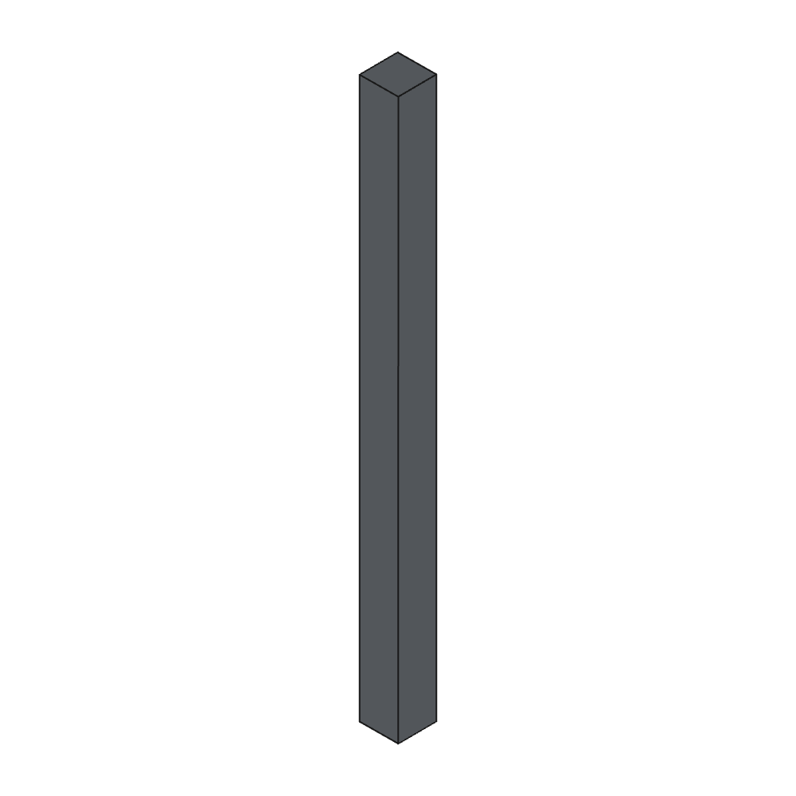
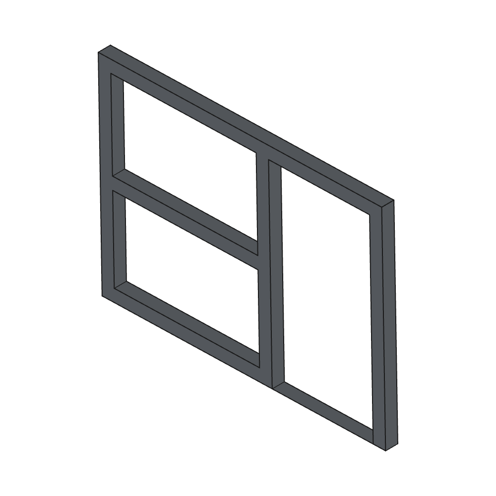

# bicycle_shed

[https://www.thingiverse.com/thing:0](https://www.thingiverse.com/thing:0)

TODO.

## Images

## Source - Files

<table>
  <tr>
    <th>Source file</th>
    <th>Preview</th>
  </tr>
  <tr>
    <td>
        <a href="source/assembly.FCStd">source/assembly.FCStd</a>
    </td>
    <td>
        
    </td>
  </tr>
  <tr>
    <td>
        <a href="source/assembly_v1.FCStd">source/assembly_v1.FCStd</a>
    </td>
    <td>
        
    </td>
  </tr>
  <tr>
    <td>
        <a href="source/assembly_v2.FCStd">source/assembly_v2.FCStd</a>
    </td>
    <td>
        
    </td>
  </tr>
  <tr>
    <td>
        <a href="source/bar_1800.FCStd">source/bar_1800.FCStd</a>
    </td>
    <td>
        
    </td>
  </tr>
  <tr>
    <td>
        <a href="source/bar_1920.FCStd">source/bar_1920.FCStd</a>
    </td>
    <td>
        
    </td>
  </tr>
  <tr>
    <td>
        <a href="source/bar_2390.FCStd">source/bar_2390.FCStd</a>
    </td>
    <td>
        
    </td>
  </tr>
  <tr>
    <td>
        <a href="source/bar_2680.FCStd">source/bar_2680.FCStd</a>
    </td>
    <td>
        
    </td>
  </tr>
  <tr>
    <td>
        <a href="source/bar_2800.FCStd">source/bar_2800.FCStd</a>
    </td>
    <td>
        
    </td>
  </tr>
  <tr>
    <td>
        <a href="source/bar_2920.FCStd">source/bar_2920.FCStd</a>
    </td>
    <td>
        
    </td>
  </tr>
  <tr>
    <td>
        <a href="source/bar_3000.FCStd">source/bar_3000.FCStd</a>
    </td>
    <td>
        
    </td>
  </tr>
  <tr>
    <td>
        <a href="source/bar_roof.FCStd">source/bar_roof.FCStd</a>
    </td>
    <td>
        
    </td>
  </tr>
  <tr>
    <td>
        <a href="source/bar_roof_angled.FCStd">source/bar_roof_angled.FCStd</a>
    </td>
    <td>
        
    </td>
  </tr>
  <tr>
    <td>
        <a href="source/bar_support.FCStd">source/bar_support.FCStd</a>
    </td>
    <td>
        
    </td>
  </tr>
  <tr>
    <td>
        <a href="source/bar_vertical.FCStd">source/bar_vertical.FCStd</a>
    </td>
    <td>
        
    </td>
  </tr>
  <tr>
    <td>
        <a href="source/floor.FCStd">source/floor.FCStd</a>
    </td>
    <td>
        
    </td>
  </tr>
  <tr>
    <td>
        <a href="source/roof.FCStd">source/roof.FCStd</a>
    </td>
    <td>
        
    </td>
  </tr>
  <tr>
    <td>
        <a href="source/roof_plate.FCStd">source/roof_plate.FCStd</a>
    </td>
    <td>
        
    </td>
  </tr>
  <tr>
    <td>
        <a href="source/side_element.FCStd">source/side_element.FCStd</a>
    </td>
    <td>
        
    </td>
  </tr>
  <tr>
    <td>
        <a href="source/slate_cover_half.FCStd">source/slate_cover_half.FCStd</a>
    </td>
    <td>
        
    </td>
  </tr>
</table>

## 3D - Files

## GCode - Files
NONE