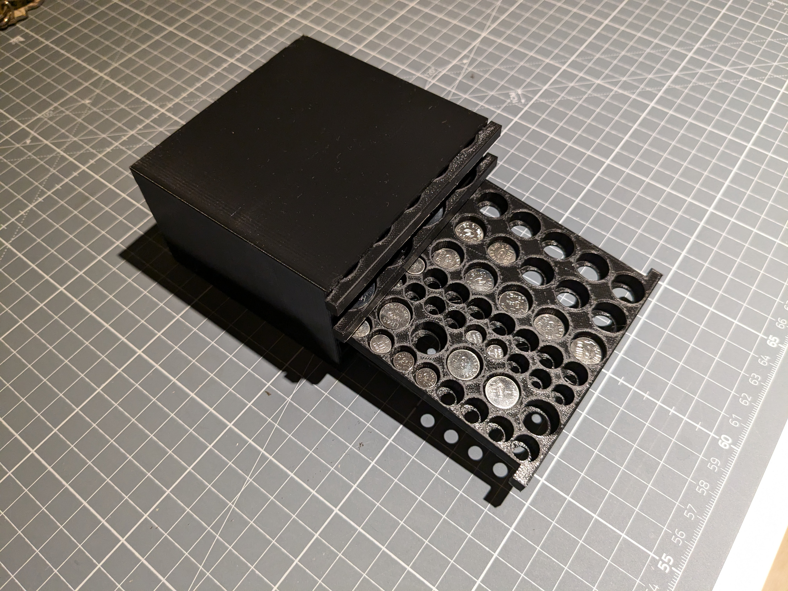
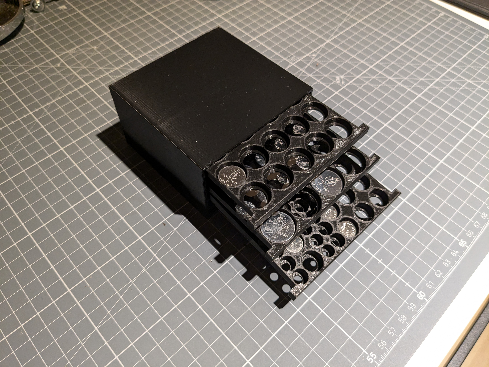
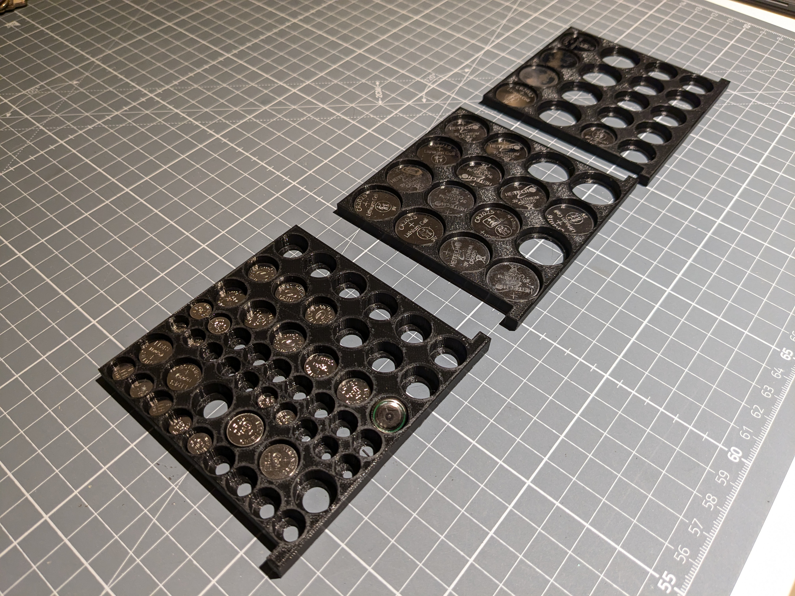
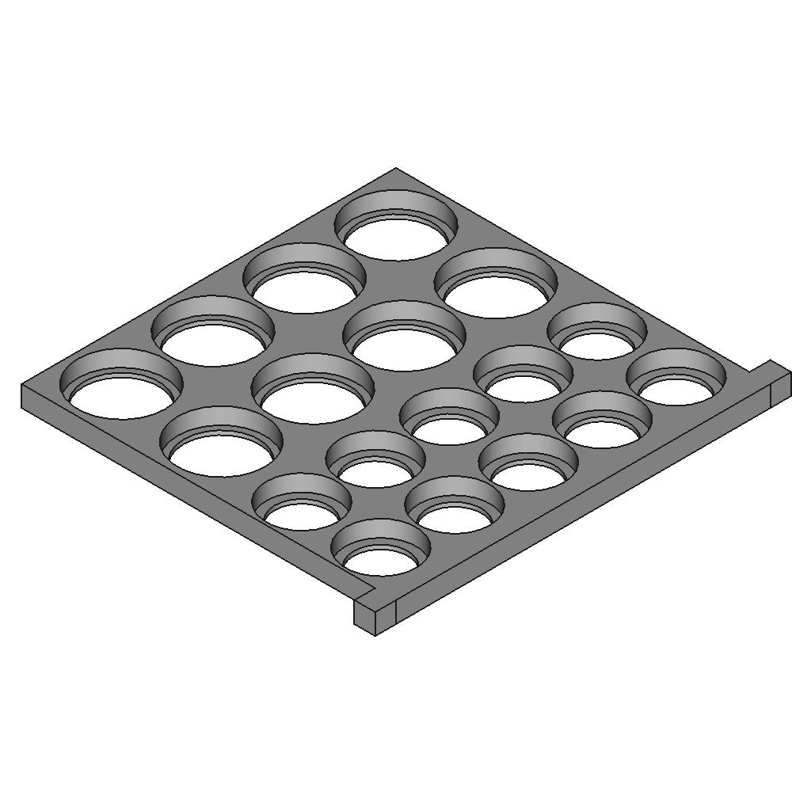
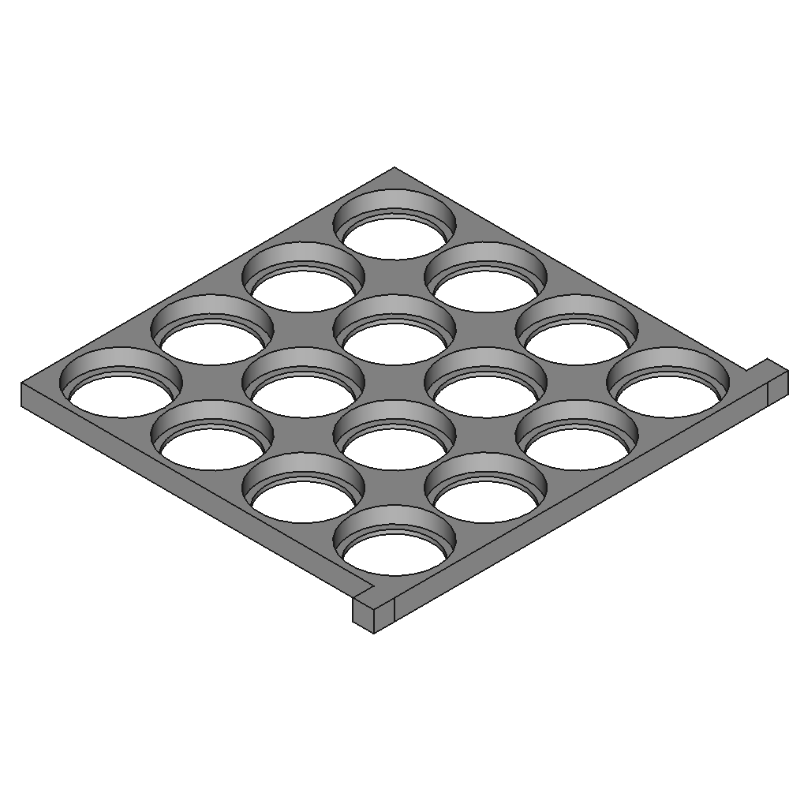
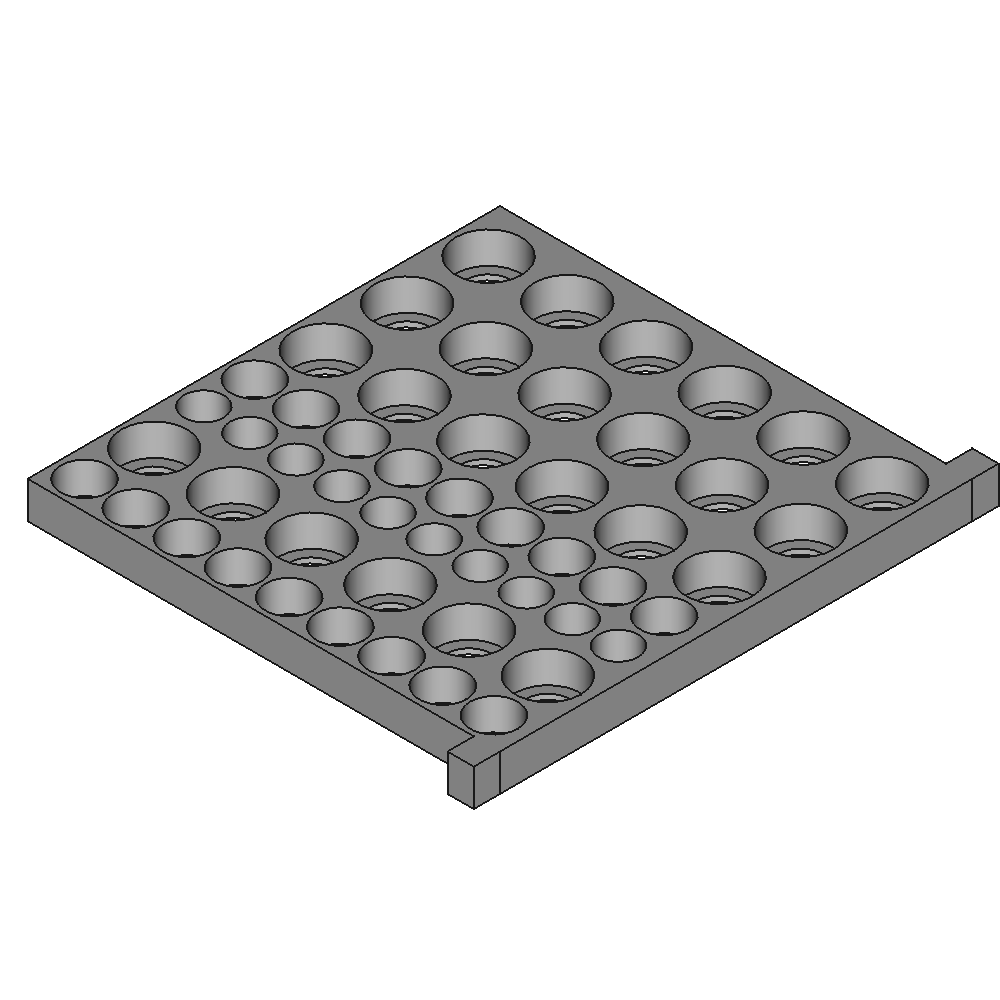
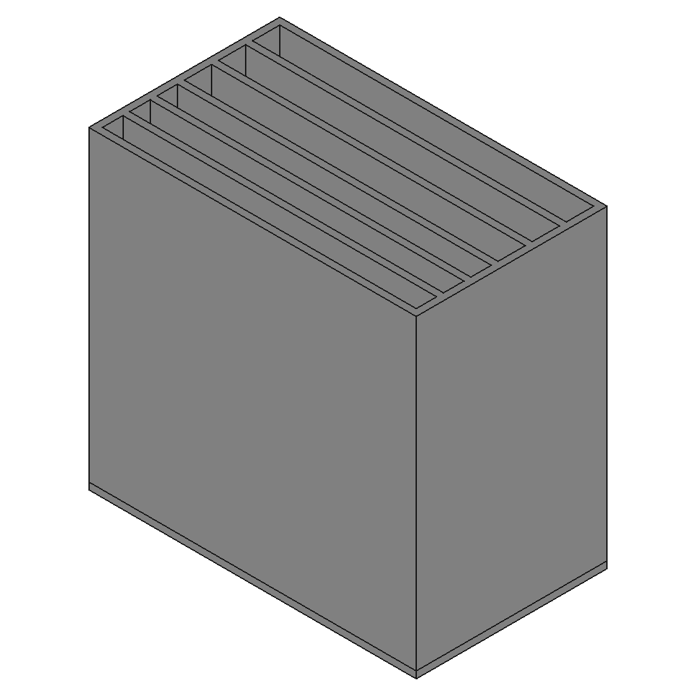

# Drawer style coin battery storage

[https://www.thingiverse.com/thing:0](https://www.thingiverse.com/thing:0)

A drawer style storage for coin batteries of different types. The case comes with two heights to support different coin heights.

## Images

## Source - Files

<table>
  <tr>
    <th>Source file</th>
    <th>Preview</th>
  </tr>
  <tr>
    <td>
        <a href="source/inlet_LR20xx_2x4_LR16xx_2x4.FCStd">source/inlet_LR20xx_2x4_LR16xx_2x4.FCStd</a>
    </td>
    <td>
        
    </td>
  </tr>
  <tr>
    <td>
        <a href="source/inlet_LR20xx_4x4.FCStd">source/inlet_LR20xx_4x4.FCStd</a>
    </td>
    <td>
        
    </td>
  </tr>
  <tr>
    <td>
        <a href="source/inlet_LR41_LR43_LR44_LR621_LR626_LR754_LR1120_LR1130.FCStd">source/inlet_LR41_LR43_LR44_LR621_LR626_LR754_LR1120_LR1130.FCStd</a>
    </td>
    <td>
        
    </td>
  </tr>
  <tr>
    <td>
        <a href="source/outlet_3x5mm_3x7mm.FCStd">source/outlet_3x5mm_3x7mm.FCStd</a>
    </td>
    <td>
        
    </td>
  </tr>
</table>

## 3D - Files
* [3d/inlet_LR20xx_2x4_LR16xx_2x4-Body.stl](3d/inlet_LR20xx_2x4_LR16xx_2x4-Body.stl)
* [3d/inlet_LR20xx_4x4-Body.stl](3d/inlet_LR20xx_4x4-Body.stl)
* [3d/inlet_LR41_LR43_LR44_LR621_LR626_LR754_LR1120_LR1130-Body.stl](3d/inlet_LR41_LR43_LR44_LR621_LR626_LR754_LR1120_LR1130-Body.stl)
* [3d/outlet_3x5mm_3x7mm-Body.stl](3d/outlet_3x5mm_3x7mm-Body.stl)

## GCode - Files
NONE