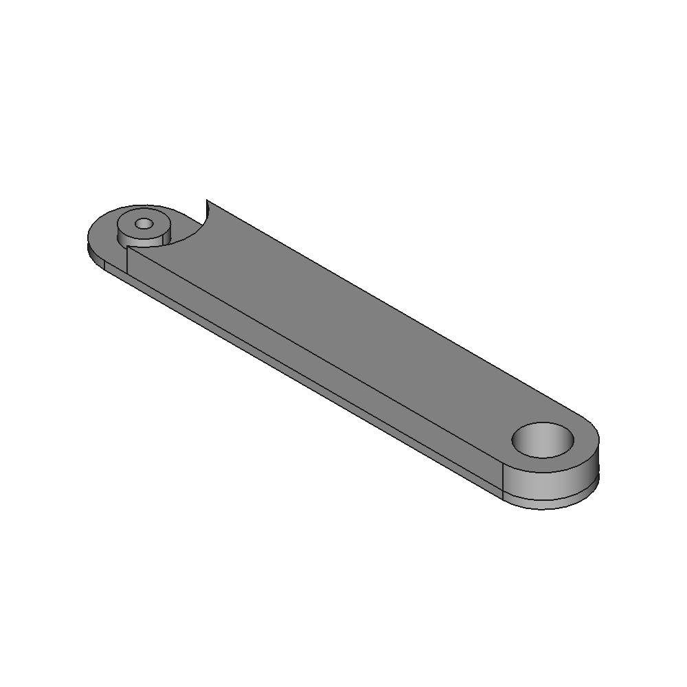
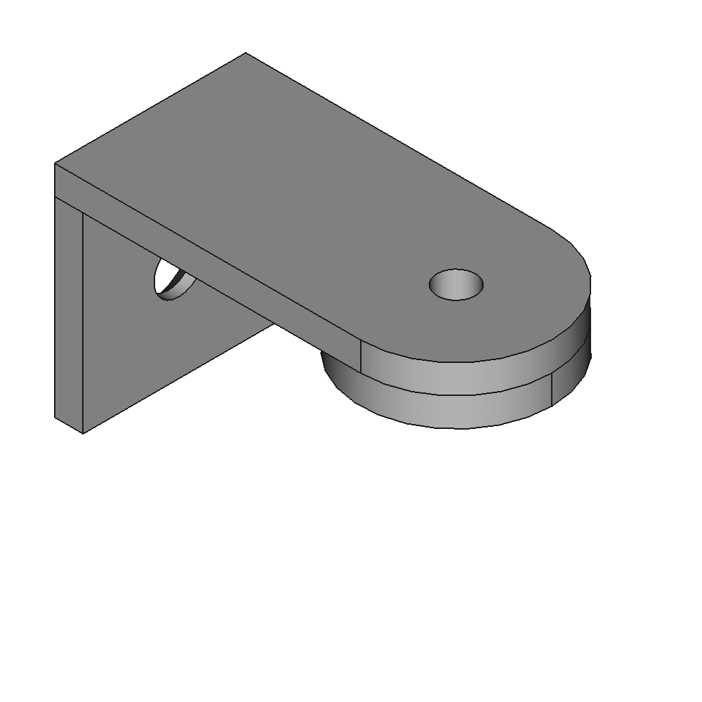
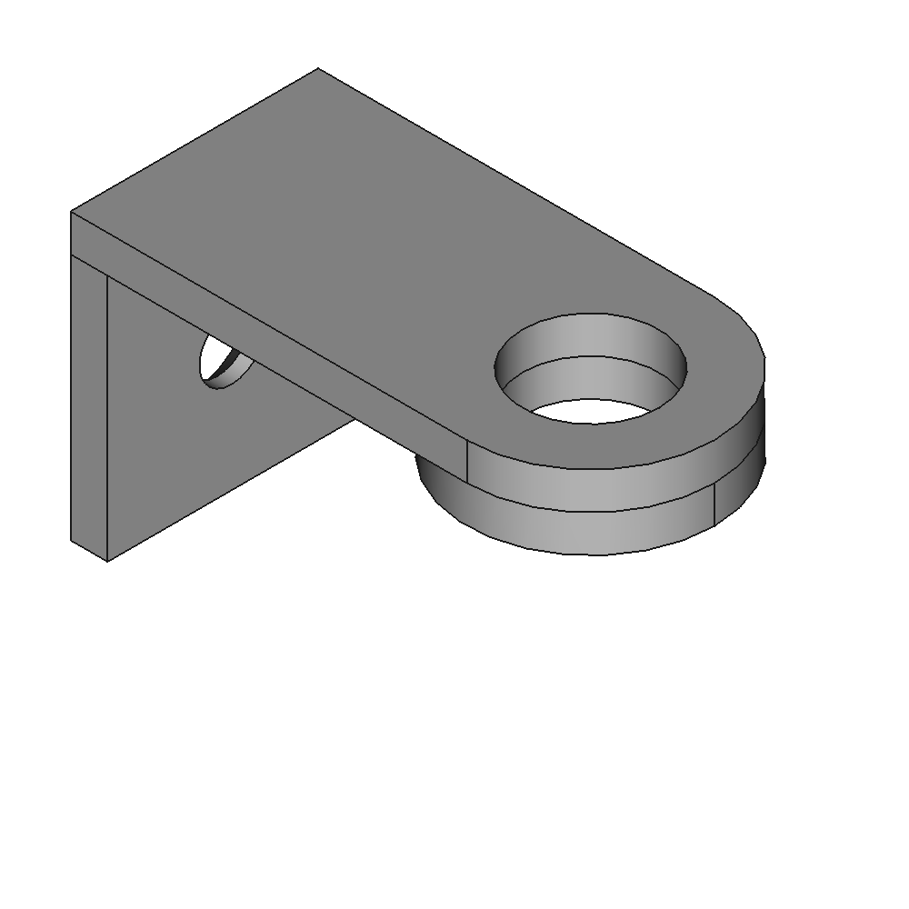

# Toy market stall sun roof

[https://www.thingiverse.com/thing:0](https://www.thingiverse.com/thing:0)

Sun roof for mechanics for my childrens toy market stall.

## Images

## Source - Files

<table>
  <tr>
    <th>Source file</th>
    <th>Preview</th>
  </tr>
  <tr>
    <td>
        <a href="source/market_stall_sun_roof_arm.FCStd">source/market_stall_sun_roof_arm.FCStd</a>
    </td>
    <td>
        
    </td>
  </tr>
  <tr>
    <td>
        <a href="source/market_stall_sun_roof_joint_a.FCStd">source/market_stall_sun_roof_joint_a.FCStd</a>
    </td>
    <td>
        
    </td>
  </tr>
  <tr>
    <td>
        <a href="source/market_stall_sun_roof_joint_b.FCStd">source/market_stall_sun_roof_joint_b.FCStd</a>
    </td>
    <td>
        
    </td>
  </tr>
</table>

## 3D - Files
* [3d/market_stall_sun_roof_arm-Body.stl](3d/market_stall_sun_roof_arm-Body.stl)
* [3d/market_stall_sun_roof_joint_a-Body.stl](3d/market_stall_sun_roof_joint_a-Body.stl)
* [3d/market_stall_sun_roof_joint_b-Body.stl](3d/market_stall_sun_roof_joint_b-Body.stl)

## GCode - Files
NONE