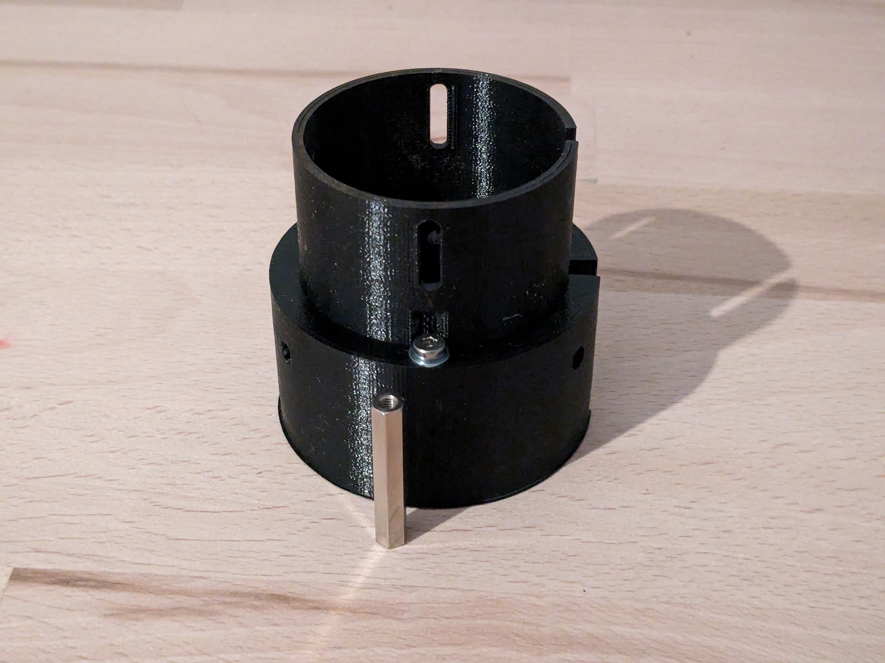

# Tomlov Microscope DM602 Ring Light Holder and Objective Protector

[https://www.thingiverse.com/thing:6462122](https://www.thingiverse.com/thing:6462122)

I got my hands on a Tomlov DM602 digital microscope recently. Haven´t had the time to use it extensively for soldering so far but especially the flex arm makes it a real eye candy on my desk. But I also discovered a few flaws immediately. The ring light attached rather poorly with three screws and there is no soldering dust protection for the lens. I picked up this idea (https://www.thingiverse.com/thing:6203074) and added a way to use the objective screws to attach it. I also added a little shield for the lens. Don´t get confused that I used a rectangle shaped acrylic glass plate instead of a round one. I had the rectangle one lying around and decided to use it for this purpose. The next time I order some acrylic glass from a professional supplier I might get a round one that fits perfectly.

## Images

## Source - Files

<table>
  <tr>
    <th>Source file</th>
    <th>Preview</th>
  </tr>
  <tr>
    <td>
        <a href="source/tomlov_dm602_objective_shield_rectangle_glass_holder.FCStd">source/tomlov_dm602_objective_shield_rectangle_glass_holder.FCStd</a>
    </td>
    <td>
        
    </td>
  </tr>
  <tr>
    <td>
        <a href="source/tomlov_dm602_ring_light_holder_and_objective_shield.FCStd">source/tomlov_dm602_ring_light_holder_and_objective_shield.FCStd</a>
    </td>
    <td>
        
    </td>
  </tr>
</table>

## 3D - Files
* [3d/tomlov_dm602_objective_shield_rectangle_glass_holder-Body.stl](3d/tomlov_dm602_objective_shield_rectangle_glass_holder-Body.stl)
* [3d/tomlov_dm602_ring_light_holder_and_objective_shield-Body.stl](3d/tomlov_dm602_ring_light_holder_and_objective_shield-Body.stl)

## GCode - Files
NONE