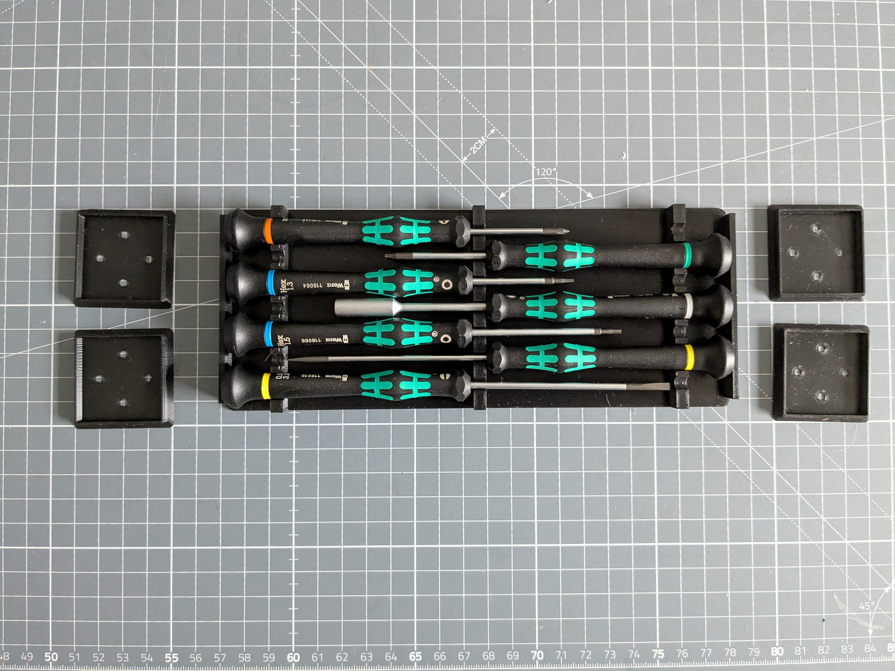
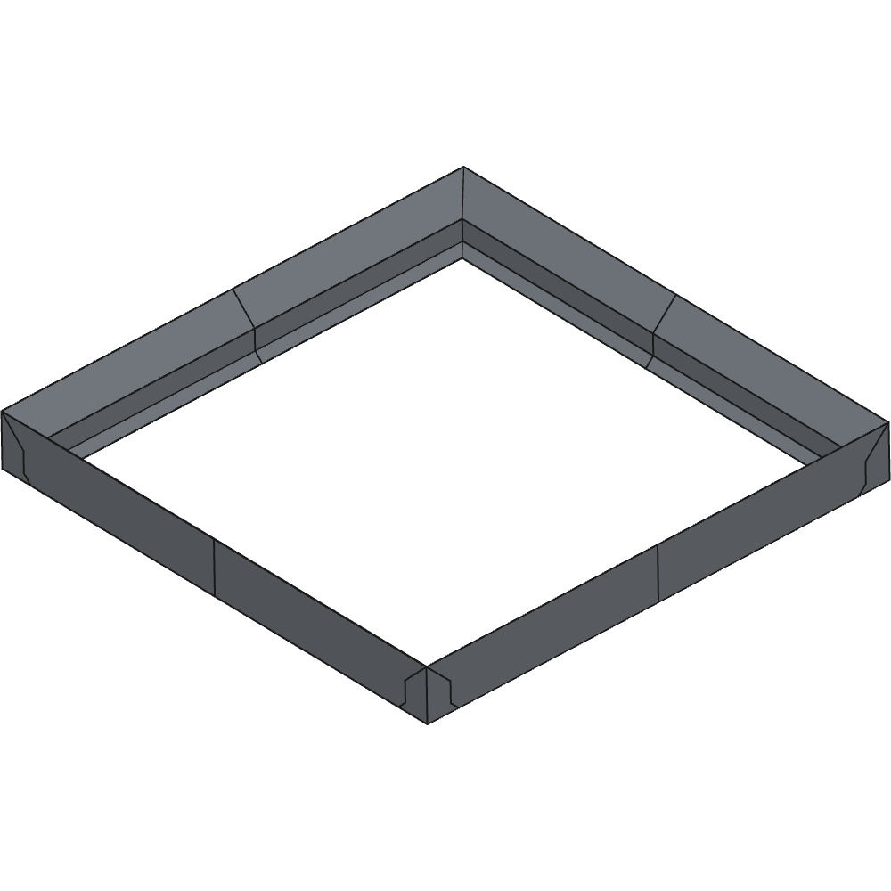

# gridfinity

[https://www.thingiverse.com/thing:0](https://www.thingiverse.com/thing:0)

TODO.

## Images

## Source - Files

<table>
  <tr>
    <th>Source file</th>
    <th>Preview</th>
  </tr>
  <tr>
    <td>
        <a href="source/custom_grid_1x1.FCStd">source/custom_grid_1x1.FCStd</a>
    </td>
    <td>
        
    </td>
  </tr>
  <tr>
    <td>
        <a href="source/custom_grid_2x2.FCStd">source/custom_grid_2x2.FCStd</a>
    </td>
    <td>
        
    </td>
  </tr>
  <tr>
    <td>
        <a href="source/custom_grid_3x4.FCStd">source/custom_grid_3x4.FCStd</a>
    </td>
    <td>
        
    </td>
  </tr>
  <tr>
    <td>
        <a href="source/custom_grid_3x4_offset_2x0mm.FCStd">source/custom_grid_3x4_offset_2x0mm.FCStd</a>
    </td>
    <td>
        
    </td>
  </tr>
  <tr>
    <td>
        <a href="source/custom_grid_3x4_offset_2x6mm.FCStd">source/custom_grid_3x4_offset_2x6mm.FCStd</a>
    </td>
    <td>
        
    </td>
  </tr>
  <tr>
    <td>
        <a href="source/custom_grid_4x4.FCStd">source/custom_grid_4x4.FCStd</a>
    </td>
    <td>
        
    </td>
  </tr>
  <tr>
    <td>
        <a href="source/custom_grid_4x4_offset_0x6mm.FCStd">source/custom_grid_4x4_offset_0x6mm.FCStd</a>
    </td>
    <td>
        
    </td>
  </tr>
  <tr>
    <td>
        <a href="source/inlet_base_light.FCStd">source/inlet_base_light.FCStd</a>
    </td>
    <td>
        
    </td>
  </tr>
</table>

## 3D - Files
* [3d/custom_grid_3x4_offset_2x0mm-Body.stl](3d/custom_grid_3x4_offset_2x0mm-Body.stl)
* [3d/custom_grid_3x4_offset_2x6mm-Body.stl](3d/custom_grid_3x4_offset_2x6mm-Body.stl)
* [3d/custom_grid_4x4-Body.stl](3d/custom_grid_4x4-Body.stl)
* [3d/custom_grid_4x4_offset_0x6mm-Body.stl](3d/custom_grid_4x4_offset_0x6mm-Body.stl)
* [3d/inlet_base_light-Body.stl](3d/inlet_base_light-Body.stl)

## GCode - Files
NONE