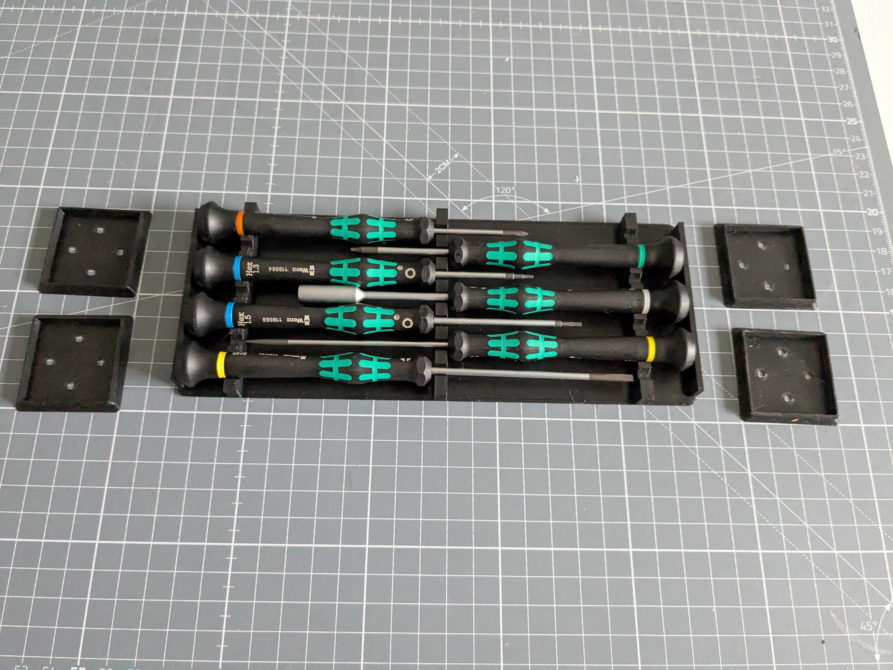
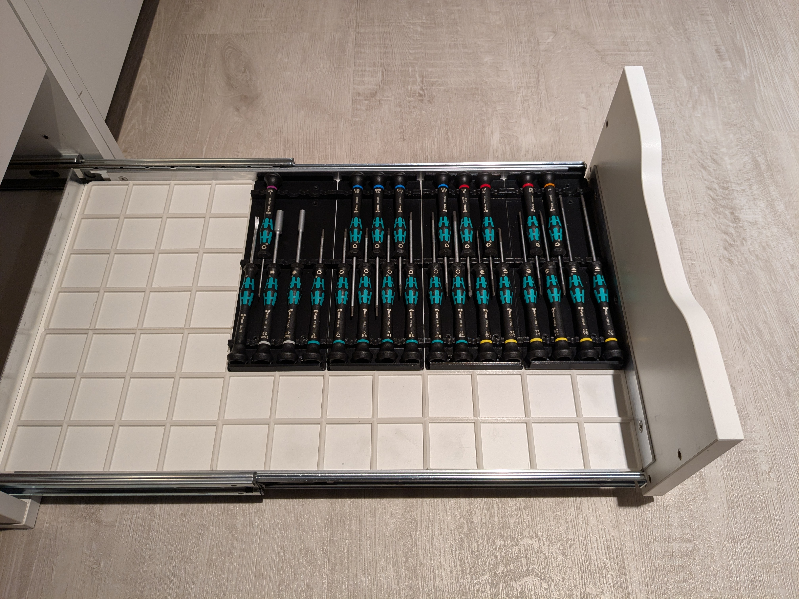
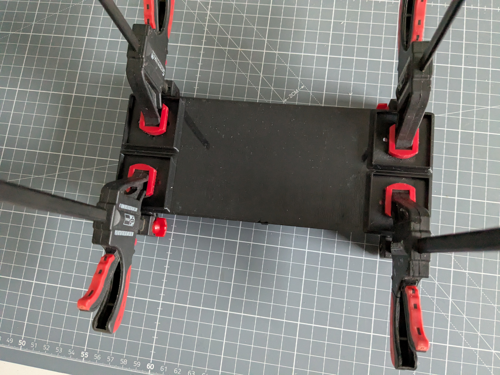
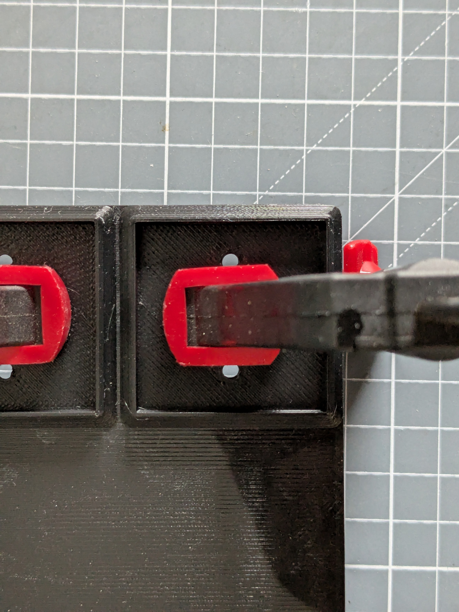
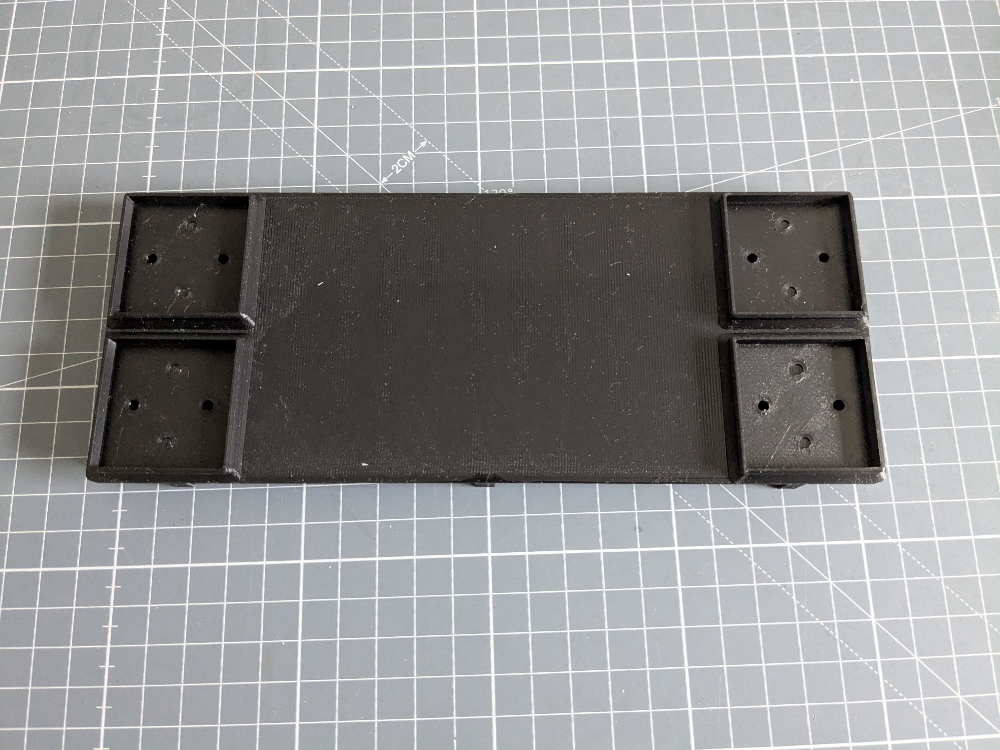
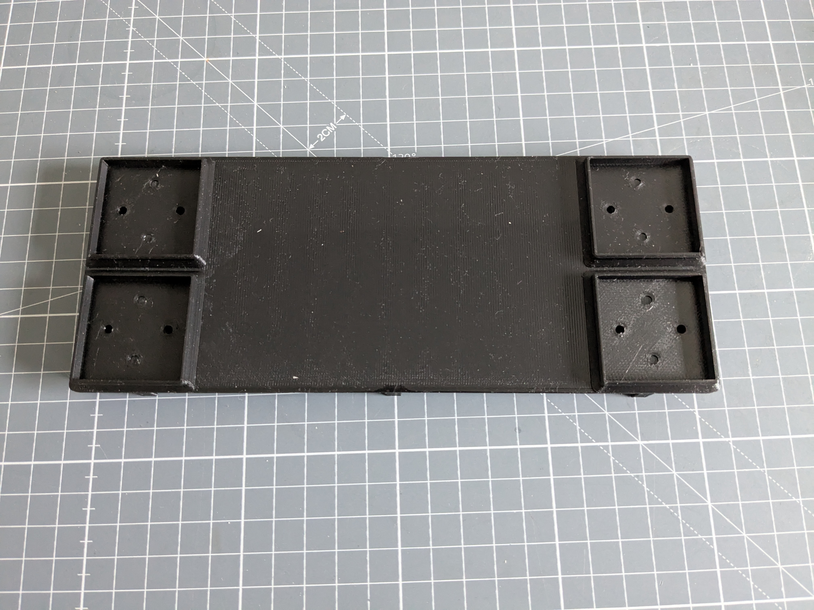
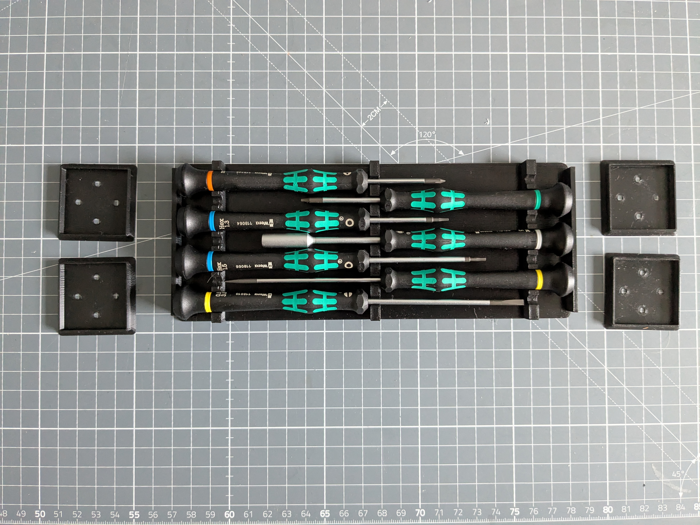

# IKEA Alex Drawer Inlets

[https://www.thingiverse.com/thing:0](https://www.thingiverse.com/thing:0)

Tool inlets for IKEA Alex drawers

## Images

## Source - Files

<table>
  <tr>
    <th>Source file</th>
    <th>Preview</th>
  </tr>
</table>

## 3D - Files
* [3d/inlet_measuring-Slice.0.0.stl](3d/inlet_measuring-Slice.0.0.stl)
* [3d/inlet_measuring-Slice.0.1.stl](3d/inlet_measuring-Slice.0.1.stl)
* [3d/inlet_measuring-Slice.1.0.stl](3d/inlet_measuring-Slice.1.0.stl)
* [3d/inlet_measuring-Slice.1.1.stl](3d/inlet_measuring-Slice.1.1.stl)
* [3d/inlet_measuring-Slice.2.0.stl](3d/inlet_measuring-Slice.2.0.stl)
* [3d/inlet_measuring-Slice.2.1.stl](3d/inlet_measuring-Slice.2.1.stl)

## GCode - Files
NONE