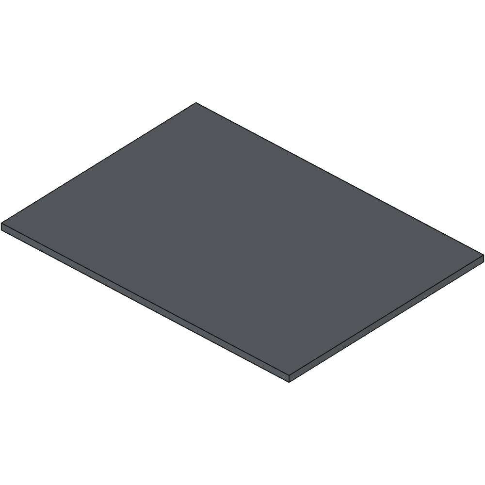
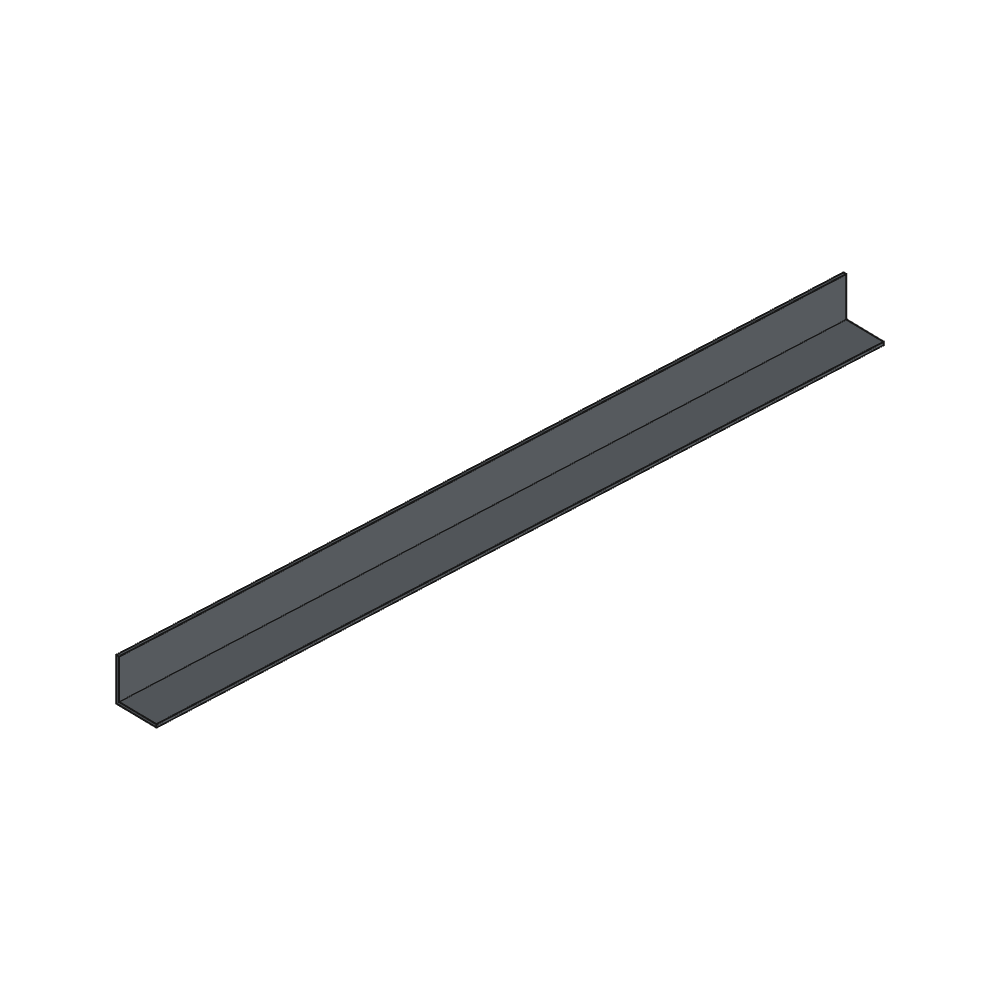

# malm_upgrade

[https://www.thingiverse.com/thing:0](https://www.thingiverse.com/thing:0)

TODO.

## Images

## Source - Files

<table>
  <tr>
    <th>Source file</th>
    <th>Preview</th>
  </tr>
  <tr>
    <td>
        <a href="source/assembly_v1.FCStd">source/assembly_v1.FCStd</a>
    </td>
    <td>
        
    </td>
  </tr>
  <tr>
    <td>
        <a href="source/base_plate.FCStd">source/base_plate.FCStd</a>
    </td>
    <td>
        
    </td>
  </tr>
  <tr>
    <td>
        <a href="source/corpus.FCStd">source/corpus.FCStd</a>
    </td>
    <td>
        
    </td>
  </tr>
  <tr>
    <td>
        <a href="source/drawer.FCStd">source/drawer.FCStd</a>
    </td>
    <td>
        
    </td>
  </tr>
  <tr>
    <td>
        <a href="source/slide.FCStd">source/slide.FCStd</a>
    </td>
    <td>
        
    </td>
  </tr>
  <tr>
    <td>
        <a href="source/slide_500.FCStd">source/slide_500.FCStd</a>
    </td>
    <td>
        
    </td>
  </tr>
  <tr>
    <td>
        <a href="source/slide_alu_profile.FCStd">source/slide_alu_profile.FCStd</a>
    </td>
    <td>
        
    </td>
  </tr>
  <tr>
    <td>
        <a href="source/slide_alu_profile_front_rear.FCStd">source/slide_alu_profile_front_rear.FCStd</a>
    </td>
    <td>
        
    </td>
  </tr>
</table>

## 3D - Files

## GCode - Files
NONE