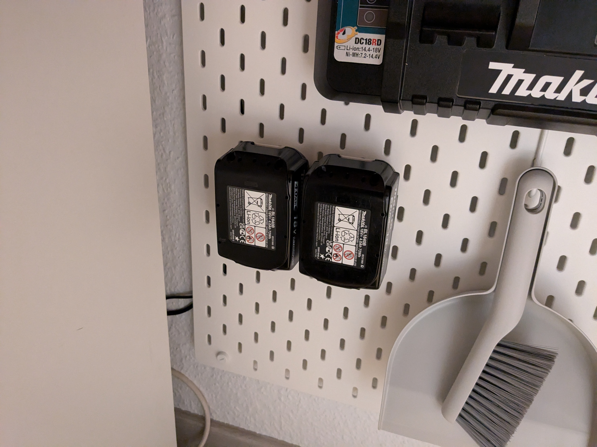
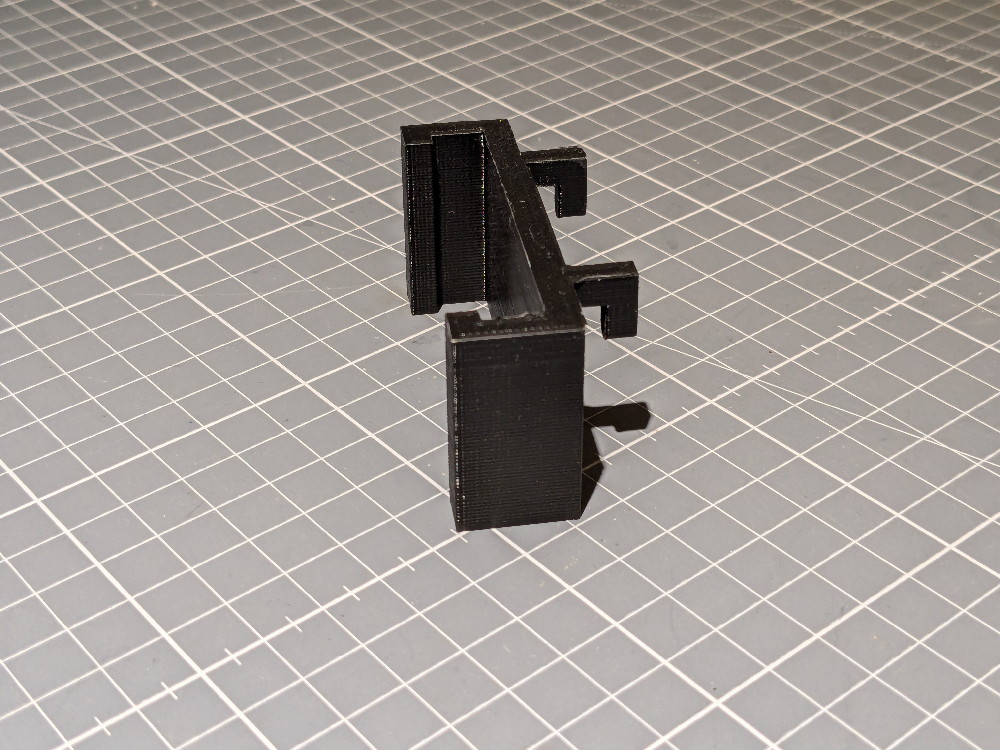
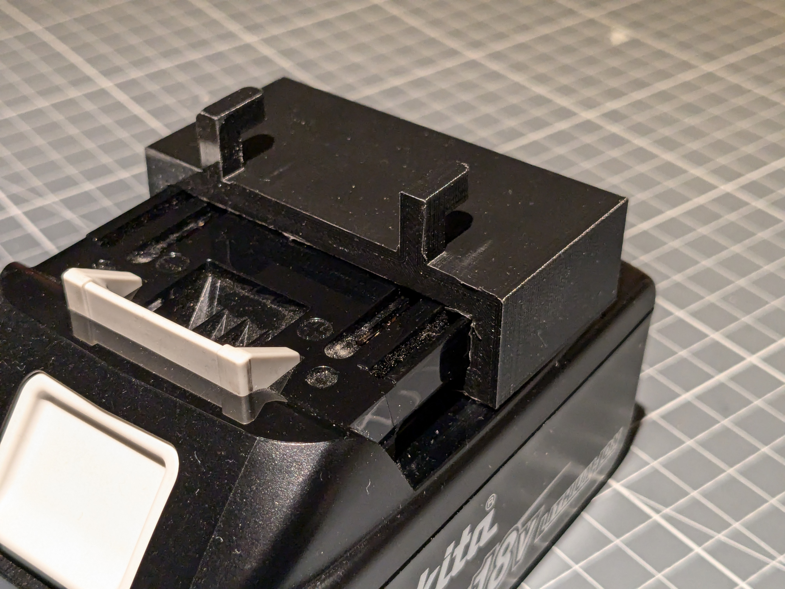
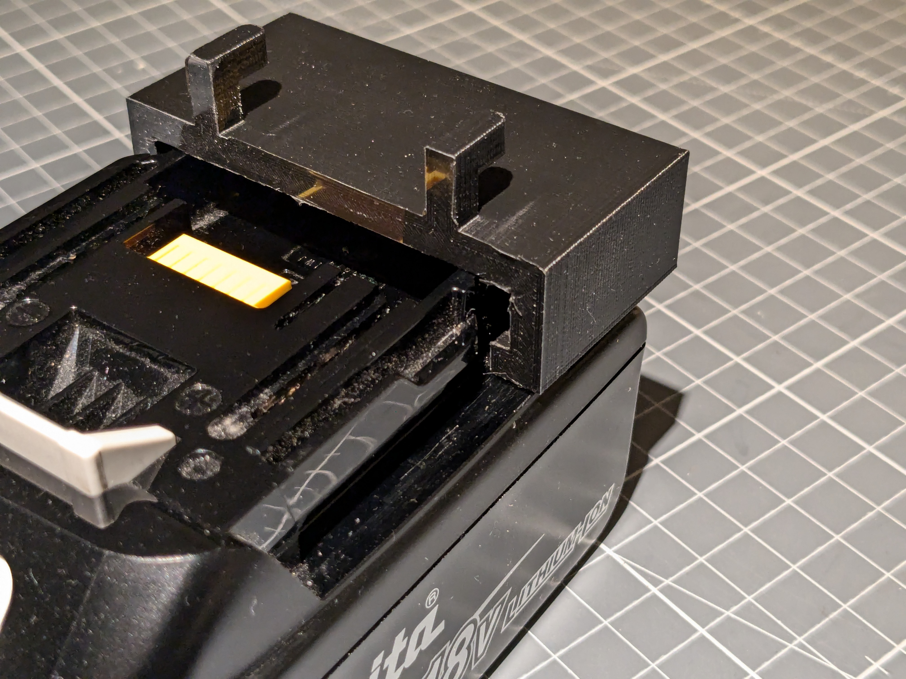
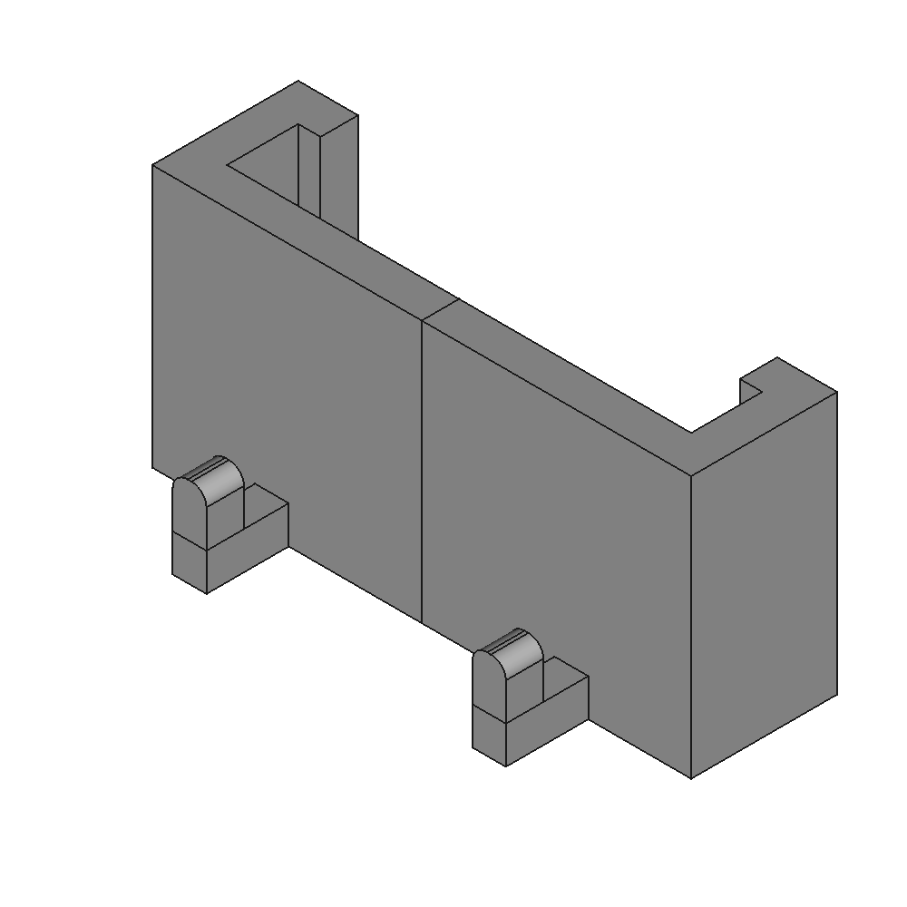

# Minimalistic Makita 18V Battery holder for IKEA Skadis

[https://www.thingiverse.com/thing:0](https://www.thingiverse.com/thing:0)

A Minimalistic IKEA Skadis holder for Makita 18V Batteries. Compared to other designs there is no unnecessary stuff and the model is printable without support and overlapping parts.

## Images

## Source - Files

<table>
  <tr>
    <th>Source file</th>
    <th>Preview</th>
  </tr>
  <tr>
    <td>
        <a href="source/makita_battery_holder_ikea_skadis.FCStd">source/makita_battery_holder_ikea_skadis.FCStd</a>
    </td>
    <td>
        
    </td>
  </tr>
</table>

## 3D - Files
* [3d/makita_battery_holder_ikea_skadis-Body.stl](3d/makita_battery_holder_ikea_skadis-Body.stl)

## GCode - Files
NONE