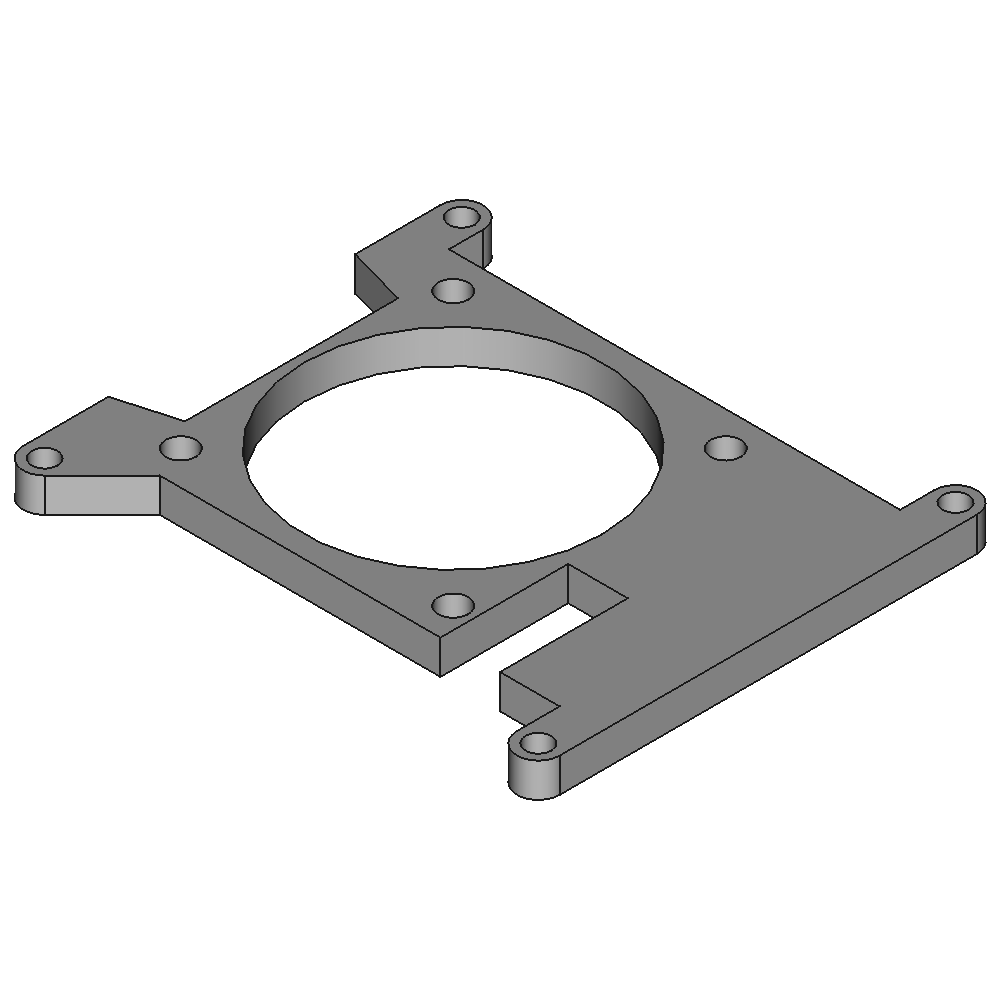

# Raspberry Pi fan holder

[https://www.thingiverse.com/thing:0](https://www.thingiverse.com/thing:0)

Yet another fan holder for the Raspberry Pi 4.

## Images

## Source - Files

<table>
  <tr>
    <th>Source file</th>
    <th>Preview</th>
  </tr>
  <tr>
    <td>
        <a href="source/raspberry_pi_fan_holder_30mm.FCStd">source/raspberry_pi_fan_holder_30mm.FCStd</a>
    </td>
    <td>
        
    </td>
  </tr>
  <tr>
    <td>
        <a href="source/raspberry_pi_fan_holder_40mm.FCStd">source/raspberry_pi_fan_holder_40mm.FCStd</a>
    </td>
    <td>
        
    </td>
  </tr>
</table>

## 3D - Files
* [3d/raspberry_pi_fan_holder_30mm-Body.stl](3d/raspberry_pi_fan_holder_30mm-Body.stl)
* [3d/raspberry_pi_fan_holder_40mm-Body.stl](3d/raspberry_pi_fan_holder_40mm-Body.stl)

## GCode - Files
NONE