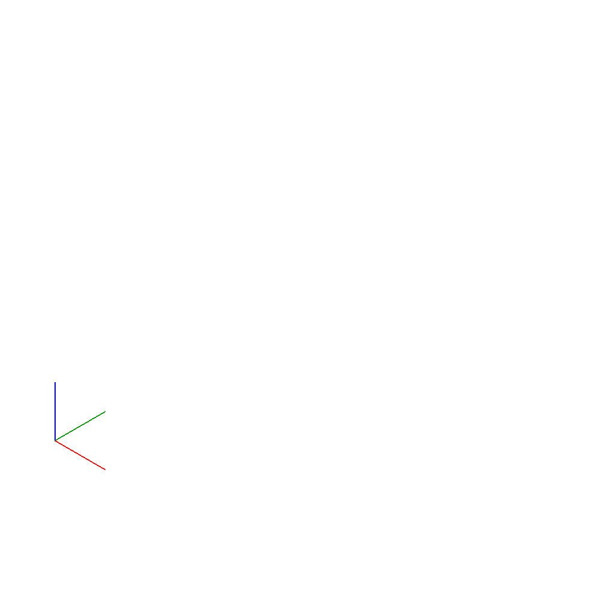
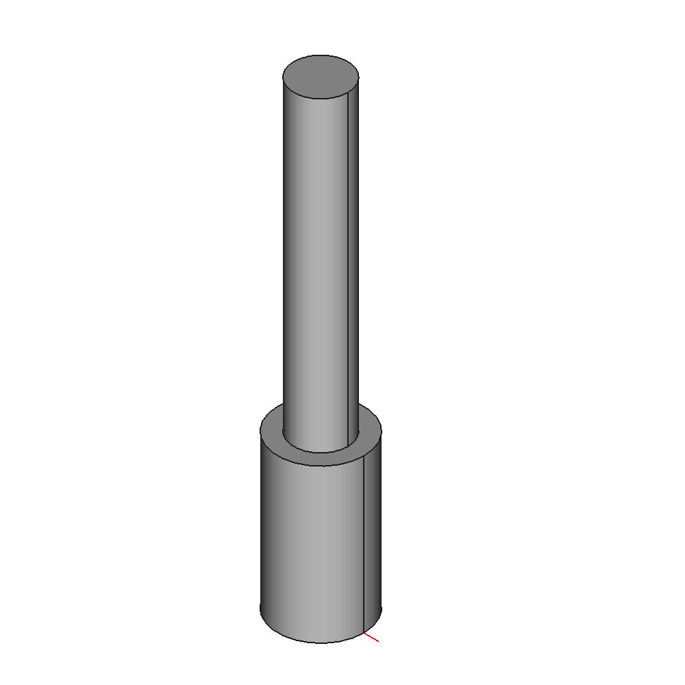
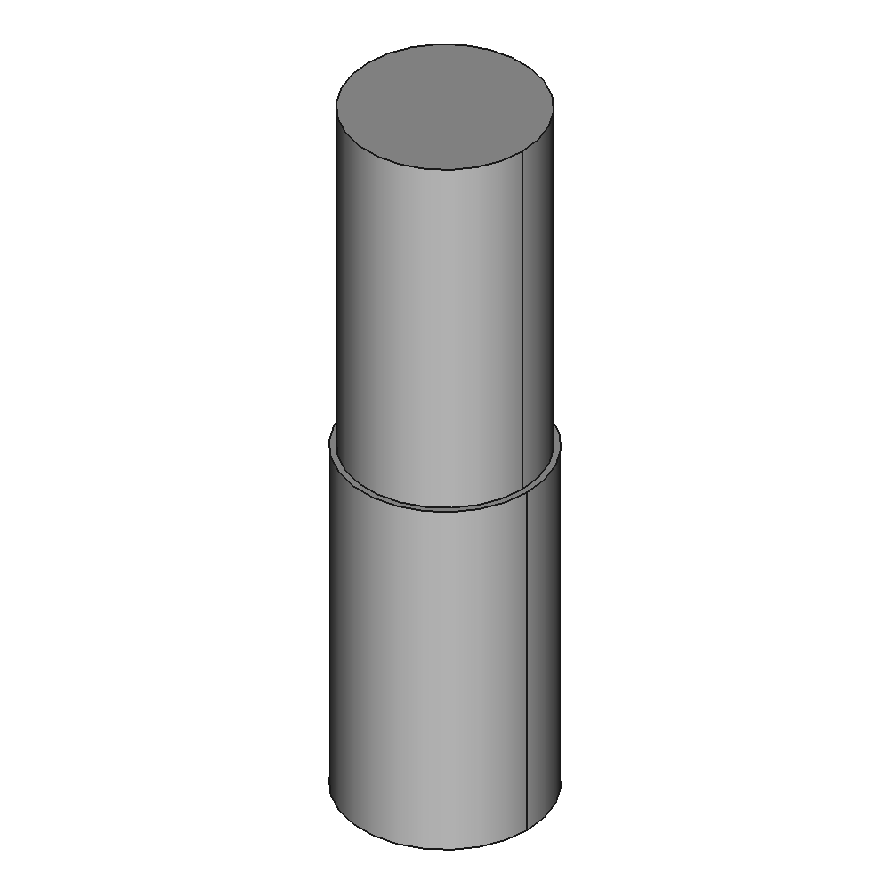
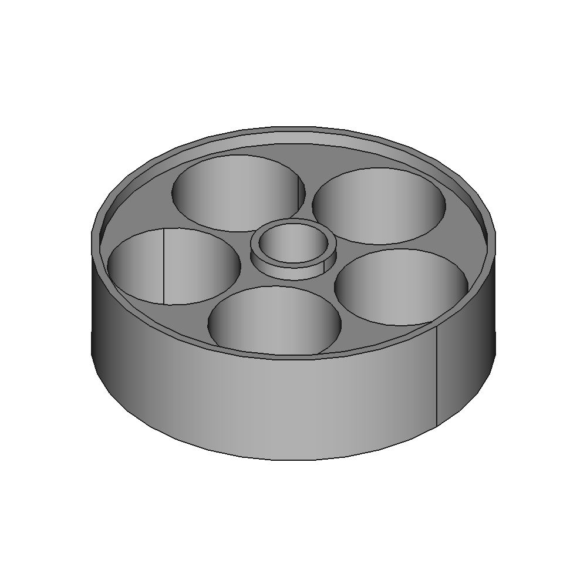

# Revell paint storage in a Stroopwafel box

[https://www.thingiverse.com/thing:0](https://www.thingiverse.com/thing:0)

I got this nice little Dutch Stroopwafel box as a gift and it was way to cute to just throw it away. I decided to build some inlets and turn it into a housing for Revell paint.

## Images

## Source - Files

<table>
  <tr>
    <th>Source file</th>
    <th>Preview</th>
  </tr>
  <tr>
    <td>
        <a href="source/component_holder_bottom.FCStd">source/component_holder_bottom.FCStd</a>
    </td>
    <td>
        
    </td>
  </tr>
  <tr>
    <td>
        <a href="source/component_holder_middle.FCStd">source/component_holder_middle.FCStd</a>
    </td>
    <td>
        
    </td>
  </tr>
  <tr>
    <td>
        <a href="source/component_holder_stack.FCStd">source/component_holder_stack.FCStd</a>
    </td>
    <td>
        
    </td>
  </tr>
  <tr>
    <td>
        <a href="source/part_center_pin_bottom.FCStd">source/part_center_pin_bottom.FCStd</a>
    </td>
    <td>
        
    </td>
  </tr>
  <tr>
    <td>
        <a href="source/part_center_pin_middle.FCStd">source/part_center_pin_middle.FCStd</a>
    </td>
    <td>
        
    </td>
  </tr>
  <tr>
    <td>
        <a href="source/part_holder.FCStd">source/part_holder.FCStd</a>
    </td>
    <td>
        
    </td>
  </tr>
</table>

## 3D - Files
* [3d/center_pin_middle-Body.stl](3d/center_pin_middle-Body.stl)
* [3d/holder-Body.stl](3d/holder-Body.stl)
* [3d/holder.stl](3d/holder.stl)
* [3d/holder_bottom-Model.stl](3d/holder_bottom-Model.stl)
* [3d/holder_middle-Model.stl](3d/holder_middle-Model.stl)

## GCode - Files
NONE