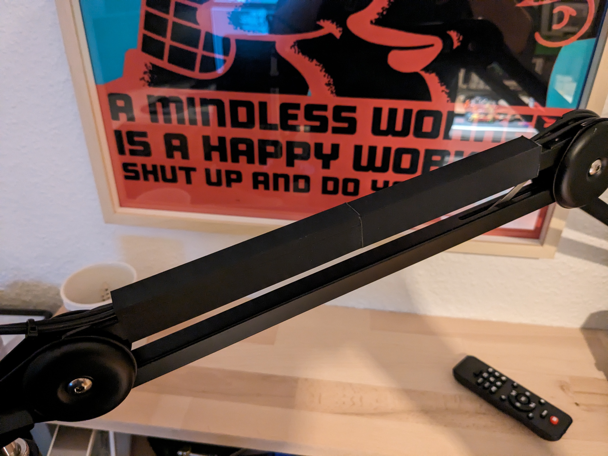
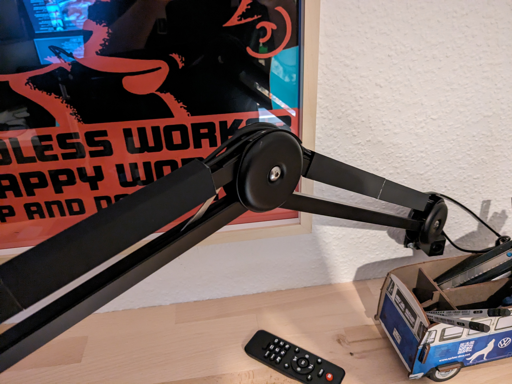
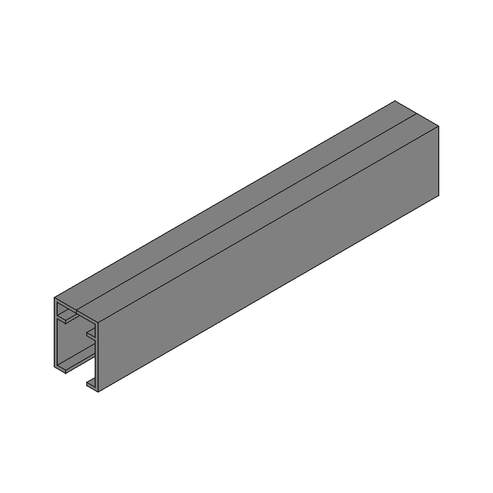

# Tomlov Microscope DM602 Flex Arm Cable Tunnel

[https://www.thingiverse.com/thing:6462141](https://www.thingiverse.com/thing:6462141)

I got my hands on a Tomlov DM602 digital microscope recently. Haven´t had the time to use it extensively for soldering so far but especially the flex arm makes it a real eye candy on my desk. I designed a simple cable tunnel for the flex arm to improve the cable management and make it look even better and cleaner. Due to the limited printing area in Z-Direction I split it up into two parts per segment. You might want to adjust the Z-Axis and scale/split it up it for your demands.

## Images

## Source - Files

<table>
  <tr>
    <th>Source file</th>
    <th>Preview</th>
  </tr>
  <tr>
    <td>
        <a href="source/tomlov_flex_arm_cable_tunnel.FCStd">source/tomlov_flex_arm_cable_tunnel.FCStd</a>
    </td>
    <td>
        
    </td>
  </tr>
</table>

## 3D - Files
* [3d/tomlov_flex_arm_cable_tunnel-Body.stl](3d/tomlov_flex_arm_cable_tunnel-Body.stl)

## GCode - Files
NONE