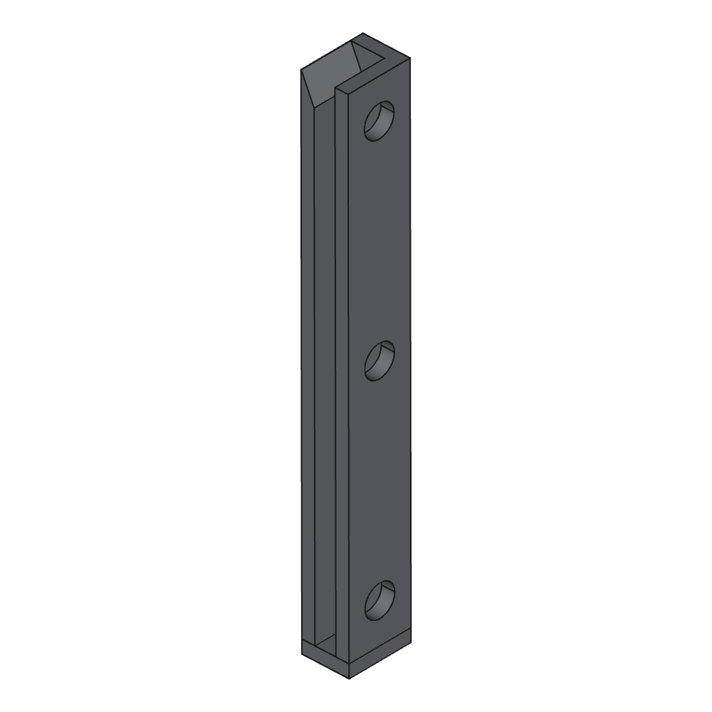

# trencher_under_table_holder

[https://www.thingiverse.com/thing:0](https://www.thingiverse.com/thing:0)

TODO.

## Images

## Source - Files

<table>
  <tr>
    <th>Source file</th>
    <th>Preview</th>
  </tr>
  <tr>
    <td>
        <a href="source/trencher_under_table_holder.FCStd">source/trencher_under_table_holder.FCStd</a>
    </td>
    <td>
        
    </td>
  </tr>
</table>

## 3D - Files
* [3d/trencher_under_table_holder-Body.stl](3d/trencher_under_table_holder-Body.stl)

## GCode - Files
NONE