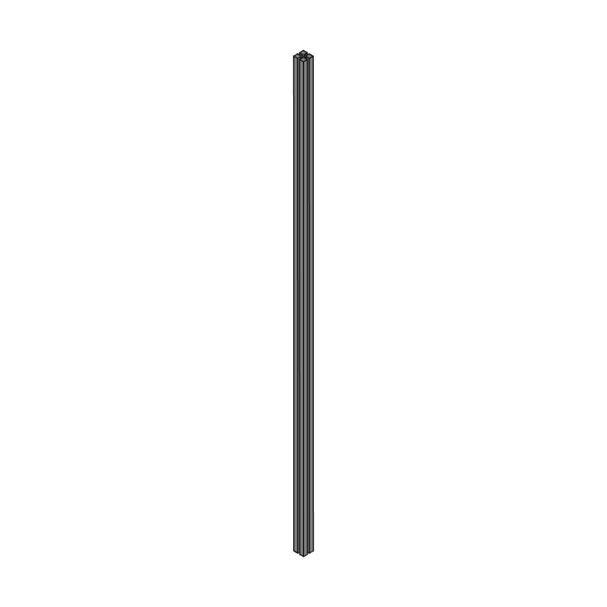
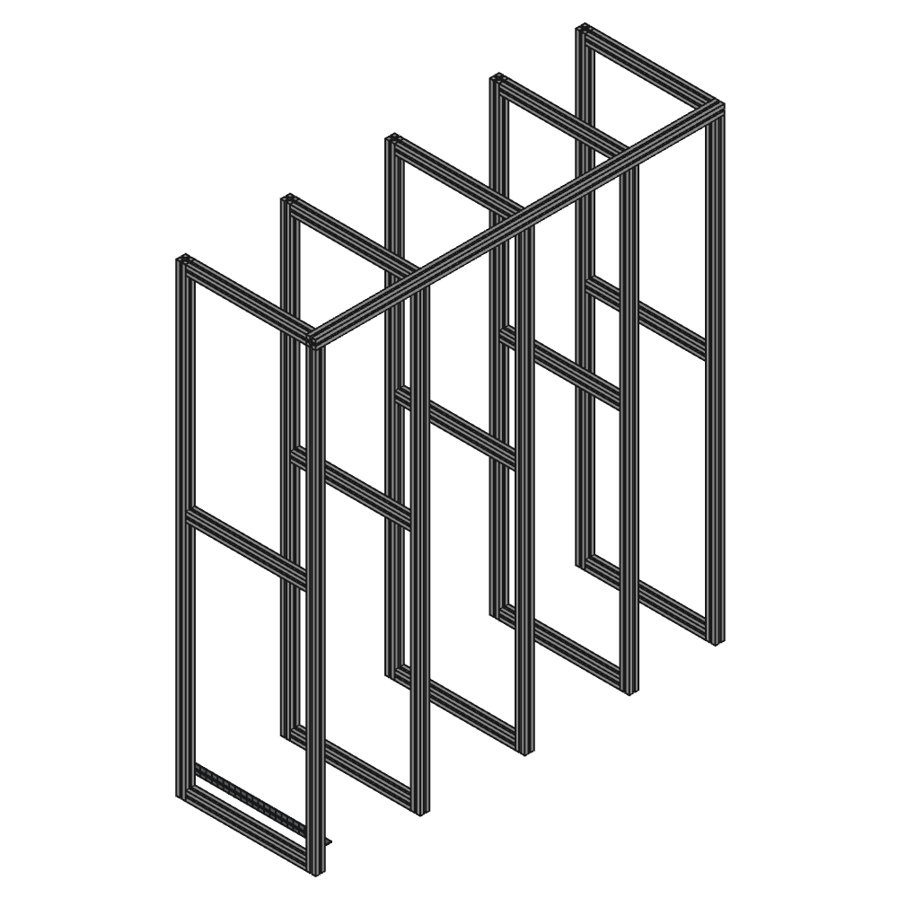
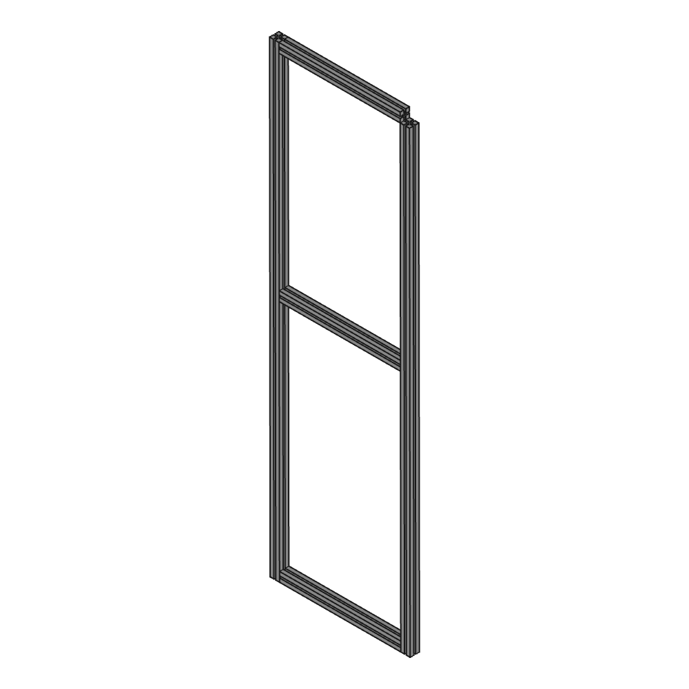

# Utility room

[https://www.thingiverse.com/thing:0](https://www.thingiverse.com/thing:0)

Room plan of my utility room

## Images

## Source - Files

<table>
  <tr>
    <th>Source file</th>
    <th>Preview</th>
  </tr>
  <tr>
    <td>
        <a href="source/item_40x40x100.FCStd">source/item_40x40x100.FCStd</a>
    </td>
    <td>
        
    </td>
  </tr>
  <tr>
    <td>
        <a href="source/item_40x40x1760.FCStd">source/item_40x40x1760.FCStd</a>
    </td>
    <td>
        
    </td>
  </tr>
  <tr>
    <td>
        <a href="source/item_40x40x1960.FCStd">source/item_40x40x1960.FCStd</a>
    </td>
    <td>
        
    </td>
  </tr>
  <tr>
    <td>
        <a href="source/item_40x40x2000.FCStd">source/item_40x40x2000.FCStd</a>
    </td>
    <td>
        
    </td>
  </tr>
  <tr>
    <td>
        <a href="source/item_40x40x520.FCStd">source/item_40x40x520.FCStd</a>
    </td>
    <td>
        
    </td>
  </tr>
  <tr>
    <td>
        <a href="source/profile.FCStd">source/profile.FCStd</a>
    </td>
    <td>
        
    </td>
  </tr>
  <tr>
    <td>
        <a href="source/room.FCStd">source/room.FCStd</a>
    </td>
    <td>
        
    </td>
  </tr>
  <tr>
    <td>
        <a href="source/room_assembly.FCStd">source/room_assembly.FCStd</a>
    </td>
    <td>
        
    </td>
  </tr>
  <tr>
    <td>
        <a href="source/shelve_assembly.FCStd">source/shelve_assembly.FCStd</a>
    </td>
    <td>
        
    </td>
  </tr>
  <tr>
    <td>
        <a href="source/side_element_assembly.FCStd">source/side_element_assembly.FCStd</a>
    </td>
    <td>
        
    </td>
  </tr>
  <tr>
    <td>
        <a href="source/soap_holder.FCStd">source/soap_holder.FCStd</a>
    </td>
    <td>
        
    </td>
  </tr>
  <tr>
    <td>
        <a href="source/spray_bottle_holder.FCStd">source/spray_bottle_holder.FCStd</a>
    </td>
    <td>
        
    </td>
  </tr>
  <tr>
    <td>
        <a href="source/spray_bottle_holder_adapter.FCStd">source/spray_bottle_holder_adapter.FCStd</a>
    </td>
    <td>
        
    </td>
  </tr>
</table>

## 3D - Files
* [3d/soap_holder-Body.stl](3d/soap_holder-Body.stl)
* [3d/spray_bottle_holder-Body.stl](3d/spray_bottle_holder-Body.stl)
* [3d/spray_bottle_holder_adapter-Body.stl](3d/spray_bottle_holder_adapter-Body.stl)

## GCode - Files
NONE